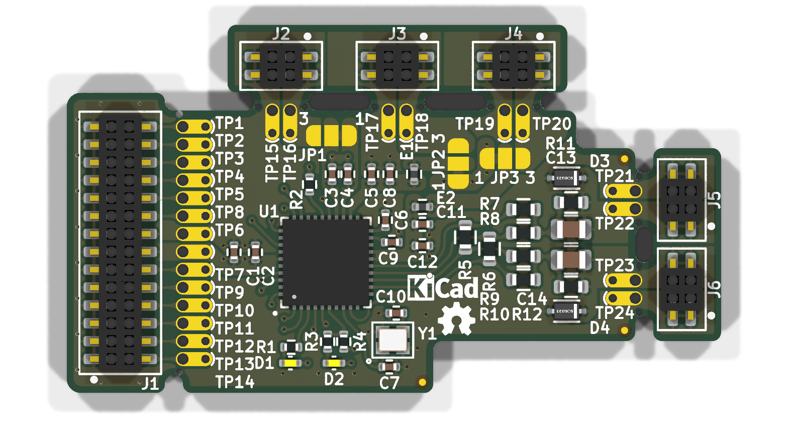

# Minimal_ADIN1110

## Overview

This repository contains a minimal KiCad design project for the Analog Devices ADIN1110, a robust, industrial, low-power 10BASE-T1L Ethernet MAC-PHY. The project is designed for industrial Ethernet applications and complies with the IEEE® 802.3cg-2019™ standard for long-reach, 10 Mbps Single Pair Ethernet (SPE).

## Disclaimer

> [!NOTE]
> This project is provided "as is" and without any warranty, express or implied. For more details, please see the [LICENSE](LICENSE) file.

## About the ADIN1110

The ADIN1110 from Analog Devices is a fully integrated and featured low-power 10BASE-T1L MAC-PHY. It is designed for use in industrial Ethernet applications and connects to a host controller via a 4-wire Serial Peripheral Interface (SPI). This allows for the use of lower-power processors without an integrated MAC, which helps to reduce overall system power consumption.

Key features include:

- **Integrated MAC and SPI Interface:** The ADIN1110 includes an integrated Media Access Control (MAC) that allows for direct connection to a host controller via a 4-wire Serial Peripheral Interface (SPI). This enables the use of lower-power processors without an integrated MAC, contributing to lower overall system power consumption.
- **Low Power Consumption:** The device features low power consumption, listed as 42 mW in a typical dual-supply scenario.
- **Long Cable Reach:** It supports a cable reach of up to 1700 meters.
- **Intrinsic Safety Support:** The ADIN1110 is suitable for intrinsic safety applications due to programmable transmit levels, external termination resistors, and independent receive and transmit pins.
- **Robustness:** It integrates voltage supply monitoring and power-on reset (POR) circuitry to enhance system-level robustness.
- **Package:** The ADIN1110 is available in a 40-lead, 6 mm × 6 mm Lead Frame Chip Scale Package (LFCSP).
- **Wide Temperature Range:** It operates over a wide temperature range of -40°C to +105°C.

## Project Structure

```
minimal_adin1110/
├── minimal_adin1110.kicad_sch       # Main schematic file
├── minimal_adin1110.kicad_pcb       # PCB layout file
├── minimal_adin1110.kicad_pro       # Project configuration file
├── fp-lib-table                     # Footprint library table
├── sym-lib-table                    # Symbol library table
├── project_jobs_set.kicad_jobset    # Project job settings
├── ibom.config.ini                  # Interactive BOM configuration
├── docs/                            # Documentation files
│   ├── pictures/                    # Images and photos
│   ├── schematics/                  # Schematic PDF exports
│   └── 3d_models/                   # 3D model files
└── KiCAD_Symbols_Generator/         # Submodule for symbol generation from CSV data
```

## Project Features

This design provides a minimal implementation of the ADIN1110 with the following features:

- **Power Supply:**
  - VIN: +3.3V
- **Channel Configuration:**
  - Basic protection circuits for the Ethernet twisted pair.
- **Bill of Materials (BOM):**
  - Interactive HTML BOM (`ibom.html`) for easy component identification and sourcing.
- **Libraries:**
  - Comprehensive symbol and footprint libraries integrated as a submodule.
- **3D Model:**
  - Includes a 3D model of the board for better visualization.

## Getting Started

### Prerequisites

- [KiCad EDA](https://www.kicad.org/) version 9.0 or later installed on your system
- Git (for cloning the repository and submodule management)

### Opening the Project

1. **Clone the repository** (including submodules):
   ```bash
   git clone --recursive https://github.com/ionutms/Minimal_ADIN1110.git
   ```
   
   If you've already cloned the repository without submodules, initialize them with:
   ```bash
   git submodule init
   git submodule update
   ```

2. **Open the project in KiCad**:
   - Launch KiCad
   - Click "Open Existing Project"
   - Navigate to the cloned repository folder
   - Select the `minimal_adin1110.kicad_pro` file

3. **Explore the design**:
   - Open the schematic editor to view the circuit design
   - Open the PCB editor to view the board layout
   - Review the symbol and footprint libraries used in the design

### Project Files

- **Main schematic**: `minimal_adin1110.kicad_sch` - Contains the primary circuit design with the ADIN1110 and support components
- **PCB layout**: `minimal_adin1110.kicad_pcb` - Physical board design file with proper component placement
- **Project configuration**: `minimal_adin1110.kicad_pro` - KiCad project settings

## Dependencies

This project has the following dependencies:

### 1. KiCAD Symbols Generator

This repository uses [KiCAD_Symbols_Generator](https://github.com/ionutms/KiCAD_Symbols_Generator) as a submodule for custom symbol generation.

To initialize the submodule after cloning this repository:

```bash
git submodule update --init --recursive
```

### 2. 3D Models

This project requires the [3D_Models_Vault](https://github.com/ionutms/3D_Models_Vault) repository for 3D models.

#### Setup for KiCAD 9:

1. Clone the 3D models repository:
   ```bash
   git clone https://github.com/ionutms/3D_Models_Vault.git
   ```

2. In KiCAD 9, add an environment variable:
   - Variable name: `KICAD9_3D_MODELS_VAULT`
   - Variable value: Full path to where you cloned the 3D_Models_Vault repository

## Usage

After setting up the dependencies, open the project in KiCAD 9 to access all features including the 3D models.

## Symbol Generator Submodule

This project includes the KiCAD_Symbols_Generator as a submodule, which provides tools for generating KiCad symbols from CSV data files. For more information on using this tool, see the [KiCAD_Symbols_Generator documentation](minimal_adin1110/KiCAD_Symbols_Generator/README.md).

## Documentation

The `docs` folder contains:
- Schematic PDF exports
- Images and photos of the design
- 3D model files (GLB and WRL formats)

## Visuals

The following images showcase the PCB design from different perspectives:


*Top View of the PCB*


*Side View of the PCB*


*Bottom View of the PCB*

## License

This project is licensed under the MIT License - see the [LICENSE](LICENSE) file for details.

## References

- [ADIN1110 Datasheet](https://www.analog.com/media/en/technical-documentation/data-sheets/adin1110.pdf)
- [KiCad EDA](https://www.kicad.org/)
